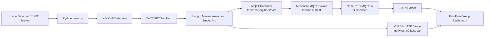
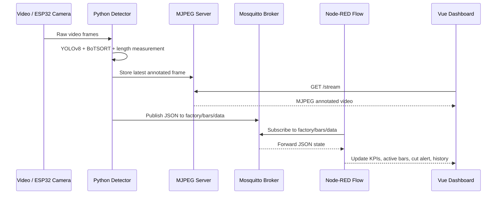

# Industrial Steel Bar Detector (El Fouladh Steel Plant)


Master's PFE end-of-studies project for real-time industrial steel bar detection, tracking, length monitoring, and supervision at the El Fouladh steel plant.

The system detects steel bars with YOLOv8, tracks them with BoTSORT, monitors the 3.00 m cutting target, serves annotated video through an MJPEG HTTP stream, and publishes live production state to a FlowFuse / Node-RED Vue.js dashboard over MQTT.

## Architecture



Runtime data flow:



## MQTT Architecture

Mosquitto is the MQTT broker used by this project. It is a lightweight message router: publishers send messages to topics, subscribers listen to topics, and the broker forwards each message to the right subscribers.

In this project:

- **Publisher:** `main.py` uses `paho-mqtt` to publish detection state.
- **Broker:** Mosquitto listens on `localhost:1883`.
- **Topic:** `factory/bars/data`.
- **Subscriber:** Node-RED `mqtt in` node receives the JSON payload.
- **Consumer UI:** The FlowFuse / Vue.js dashboard displays the stream URL, active bars, cut alert, FPS, and production history.

Example MQTT payload:

```json
{
  "active_count": 1,
  "active_bars": [
    {
      "id": 7,
      "length": 2.84,
      "confidence": 0.931,
      "motion": "Moving"
    }
  ],
  "history": [
    {
      "id": 6,
      "length": 3.0,
      "date": "24/05/2026",
      "time": "22:15:30",
      "timestamp": "2026-05-24T22:15:30",
      "command": "CUT"
    }
  ],
  "cut_signal": false,
  "target_length": 3.0,
  "fps": 12.8,
  "status": "RUNNING",
  "streamUrl": "http://127.0.0.1:8081/stream"
}
```

## Features

- YOLOv8 inference with the included model: `models/best.pt`
- BoTSORT tracking for stable steel bar IDs
- 3.00 m target-length cut alert generation
- MJPEG annotated video stream for dashboard display
- MQTT JSON publishing to `factory/bars/data`
- Local video and ESP32 camera stream support
- Passive FlowFuse dashboard integration via `nodered.json`

## Prerequisites

- Python 3.9+
- Mosquitto MQTT Broker
- Node-RED / FlowFuse Dashboard
- Local video file or ESP32 camera stream

macOS Mosquitto setup:

```bash
brew install mosquitto
brew services start mosquitto
```

Debian/Ubuntu Mosquitto setup:

```bash
sudo apt update
sudo apt install mosquitto mosquitto-clients
sudo systemctl enable --now mosquitto
```

## Installation

```bash
git clone <repository-url>
cd <repository-folder>
python -m venv .venv
source .venv/bin/activate
pip install -r requirements.txt
```

## Windows Compatibility Checklist

- Create a fresh Windows virtual environment:
  ```powershell
  python -m venv .venv
  .\.venv\Scripts\activate
  pip install -r requirements.txt
  ```
- If Windows shows a PyTorch DLL error such as `c10.dll` / `WinError 1114`, install Microsoft Visual C++ Redistributable 2015-2022 x64, then reinstall the CPU build of PyTorch:
  ```powershell
  pip uninstall -y torch torchvision torchaudio ultralytics
  pip cache purge
  pip install torch torchvision torchaudio --index-url https://download.pytorch.org/whl/cpu
  pip install -r requirements.txt
  ```
- Install and start Mosquitto MQTT Broker for Windows, then keep the broker running before launching `main.py`.
- Install Mosquitto with `winget` from an Administrator PowerShell:
  ```powershell
  winget install -e --id EclipseFoundation.Mosquitto
  ```
  If `winget` is not available, download the Windows installer from the official Mosquitto website: https://mosquitto.org/download/
- Open a new PowerShell and verify that Mosquitto is installed:
  ```powershell
  where mosquitto
  ```
- For a presentation demo, the simplest option is to run Mosquitto in a dedicated PowerShell window and keep it open:
  ```powershell
  & "C:\Program Files\mosquitto\mosquitto.exe" -v
  ```
  Expected output includes a line similar to `Opening ipv4 listen socket on port 1883`.
- In another PowerShell window, check that Mosquitto is reachable before starting Node-RED:
  ```powershell
  Test-NetConnection 127.0.0.1 -Port 1883
  ```
  The expected result is `TcpTestSucceeded : True`.
- If Mosquitto was installed as a Windows service, it can also be started with:
  ```powershell
  Start-Service mosquitto
  Set-Service mosquitto -StartupType Automatic
  ```
- Node-RED MQTT broker settings for the local demo:
  ```powershell
  Server: 127.0.0.1
  Port: 1883
  TLS: disabled
  Username/password: empty
  Topic: factory/bars/data
  ```
- Launch the Python detector against the same broker:
  ```powershell
  python main.py --source video.mp4 --device cpu --mqtt-broker 127.0.0.1
  ```
- Optional MQTT debug command:
  ```powershell
  & "C:\Program Files\mosquitto\mosquitto_sub.exe" -h 127.0.0.1 -t factory/bars/data -v
  ```
  When `main.py` is running, this terminal should print the JSON messages published by the Python detector.
- The code uses `pathlib` for project paths, so both relative paths like `video.mp4` and Windows paths like `C:\path\to\video.mp4` are supported.
- Inference device selection is automatic by default. For the most reliable presentation setup, force CPU mode:
  ```powershell
  python main.py --source video.mp4 --device cpu
  ```
- If a CUDA/GPU runtime fails during inference, the detector retries on CPU automatically.
- Run OpenCV demos from a normal desktop session. `cv2.imshow()` requires a graphical Windows session and will not display correctly in headless terminals or remote shells without GUI forwarding.
- If another device must open the dashboard stream, allow Python through Windows Firewall for port `8081` and run:
  ```powershell
  python main.py --source video.mp4 --stream-public-host <windows-pc-ip>
  ```

## Usage

Standalone OpenCV demo:

```bash
python src/detect_video.py --source video.mp4 --loop
```

Local video:

```bash
python main.py --source video.mp4
```

Force CPU mode:

```bash
python main.py --source video.mp4 --device cpu
```

ESP32 stream:

```bash
python main.py --source http://<esp32-ip>:81/stream
```

Remote dashboard access:

```bash
python main.py --source video.mp4 --stream-public-host <python-host-ip>
```

The Python service publishes:

- MJPEG stream: `http://<python-host-ip>:8081/stream`
- MQTT state: `factory/bars/data`

## FlowFuse / Node-RED

Import `nodered.json` into Node-RED / FlowFuse. The dashboard is passive and displays the `streamUrl`, active detections, cut alert, FPS, and history data published by `main.py`.

For an offline Windows presentation, run Python, Mosquitto, and Node-RED on the same machine and use `127.0.0.1` for both MQTT clients. If Node-RED is hosted in FlowFuse Cloud, `localhost` points to the cloud runtime, not to the Windows laptop, so a reachable external MQTT broker is required.

## Repository Structure

```text
.
├── main.py
├── requirements.txt
├── nodered.json
├── models/
│   └── best.pt
└── src/
    ├── __init__.py
    ├── detect_camera.py
    ├── detect_video.py
    ├── measure_length.py
    └── utils.py
```

## Notes

- `models/best.pt` is committed so the project works immediately after cloning.
- `outputs/`, `runs/`, and video files are ignored by Git.
- This repository is production/inference focused; training scripts and generated experiment files are excluded.
